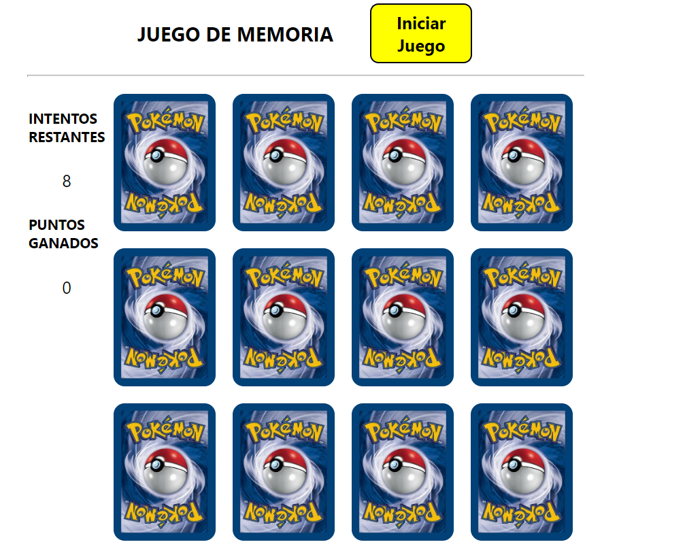

# Juego de Memoria

  

This project was bootstrapped with [Create React App](https://github.com/facebook/create-react-app).
Deployed en (https://juego-de-memoria-three.vercel.app/)

## Descripcion

Este proyecto consiste en una SPA (Sigle Page Aplication) que consume una API publica, cuyo objetivo es divertir al usuario mediante un juego de 12 cartas que se encuentran inicialmete boca abajo, y este dederá ir destapando cada carta por turnos, en cada turno puede seleccionar 2 cartas, si estas se son iguales el contador asigna un punto al contador de 'puntos ganados' y dichas cartas permaneceran destapadas, en caso contrario, las cartas volveran a su estado inicial y se restará un punto al contador de 'intentos restantes'. el juego termina cuando el usuario ha descubierto todo el tablero o cuando el numero de intentos restantes llegue a cero. Oportunidad para iniciar un nuevo grupo de cartas, y restablecer los contadores.

## Tecnologias Utilizadas
Proyecto iniciado con React create app.
- [ ] JavaScript
- [ ] React.JS
- [ ] HTML
- [ ] CSS

